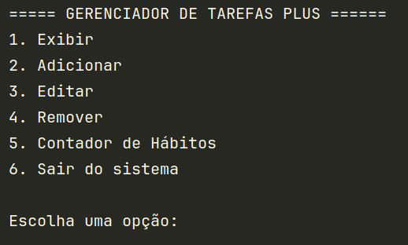
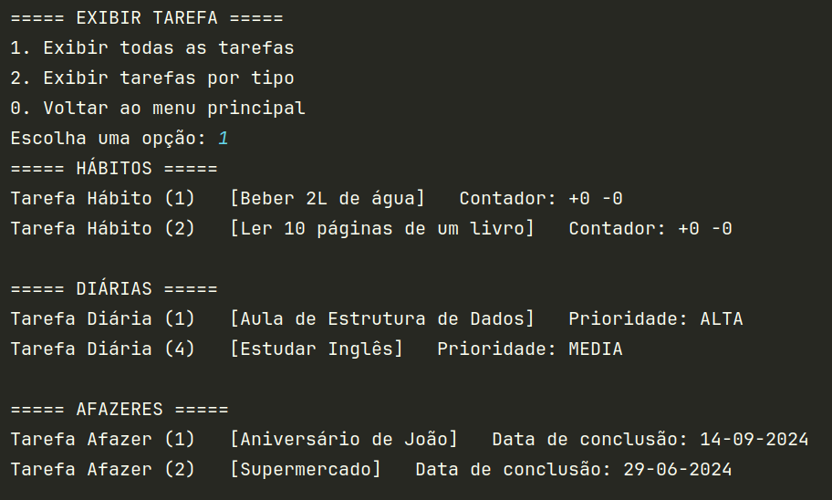

# Gerenciador de Tarefas Plus

Projeto final da disciplina Linguagem de Programação II (DIM0116).

Diagrama de classes UML: [clique aqui](https://viewer.diagrams.net/?tags=%7B%7D&title=Diagrama%20de%20Classes%20do%20Projeto.drawio#Uhttps%3A%2F%2Fdrive.google.com%2Fuc%3Fid%3D1MDQcUmNrSUBnFGPIeoevl_g7gCou4Suy%26export%3Ddownload)

## Funcionalidades Gerais
O sistema de gerenciamento de tarefas possui várias funcionalidades para facilitar o acompanhamento e a organização das atividades dos usuários. As tarefas são categorizadas em três tipos, cada uma com características específicas:

## Tipos de Tarefas

1. **TarefaHabito**: Este tipo de tarefa é destinado ao acompanhamento de hábitos que o usuário deseja adquirir.
    - **Nome**: Identificação do hábito.
    - **ContadorPositivo**: Incrementa em 1 toda vez que o hábito é concluído.
    - **ContadorNegativo**: Decrementa em 1 toda vez que o hábito não é concluído, aumentando assim a penalidade negativa (-1, -2, -3, ...).

2. **TarefaDiaria**: Tarefas rotineiras do dia a dia, que podem variar em termos de importância.
    - **Nome**: Identificação da tarefa.
    - **Prioridade**: Nível de prioridade da tarefa, podendo ser baixa, média ou alta.

3. **TarefaAfazer**: Tarefas com data marcada, como compromissos ou eventos.
    - **Nome**: Identificação da tarefa.
    - **Data**: Data específica para a realização da tarefa.

**TELA PRINCIPAL:**

**TELA DE EXIBIÇÃO:**

## Funcionalidades do Sistema
O sistema permite uma gestão das tarefas, oferecendo as seguintes funcionalidades:

### Listar Tarefas
- **Exibir todas as tarefas registradas no sistema**: Permite ao usuário visualizar todas as tarefas, independentemente do tipo.
- **Exibir tarefas filtradas por Tipo**: Permite ao usuário filtrar e visualizar apenas as tarefas de um tipo específico (TarefaHabito, TarefaDiaria ou TarefaAfazer).
- **Exibir tarefas concluídas**: Permite ao usuário visualizar todas as tarefas que já foram marcadas como concluídas.

### Adicionar Tarefas
- **Permitir adicionar novas tarefas ao sistema**: O usuário pode inserir novas tarefas, especificando os detalhes conforme o tipo da tarefa.

### Marcar como Concluída
- **Marcar uma tarefa como concluída**: Quando uma tarefa é concluída, ela é armazenada em uma coleção específica para tarefas concluídas, permitindo o acompanhamento do progresso.

### Remover Tarefas
- **Permitir remover tarefas do sistema**: O usuário pode excluir tarefas que não são mais necessárias ou que foram concluídas e não precisam ser mais acompanhadas.

### Editar Tarefas
- **Atualizar detalhes de uma tarefa existente**: O sistema permite a atualização de informações das tarefas, como nome, contadores (positivo ou negativo para TarefaHabito), prioridade (para TarefaDiaria) ou data (para TarefaAfazer).
